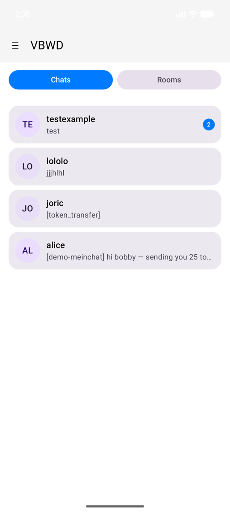
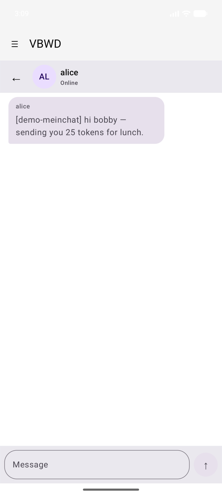
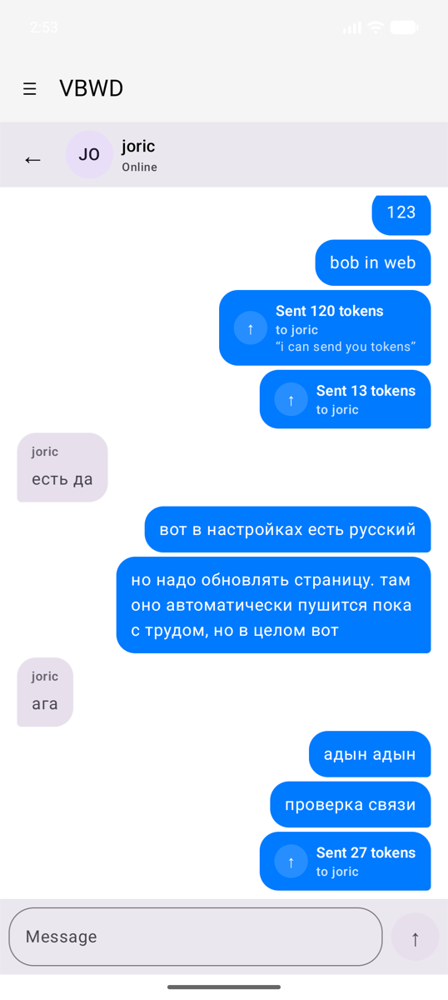
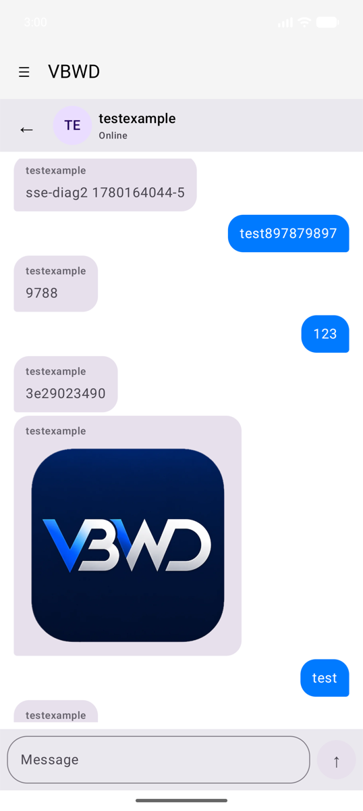
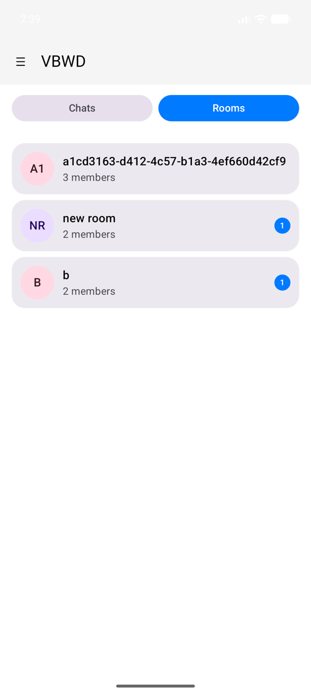
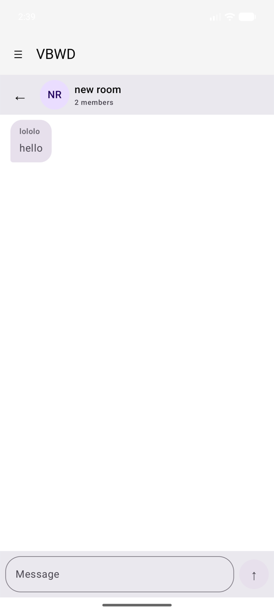
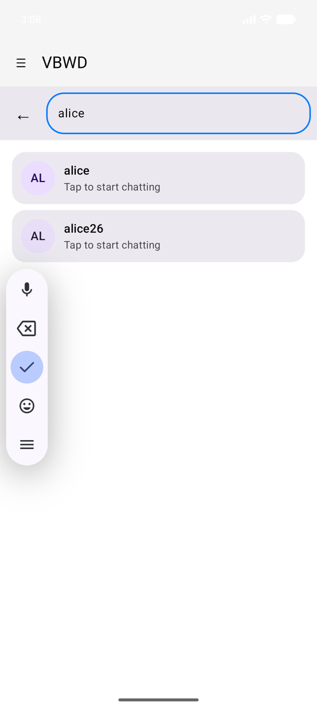
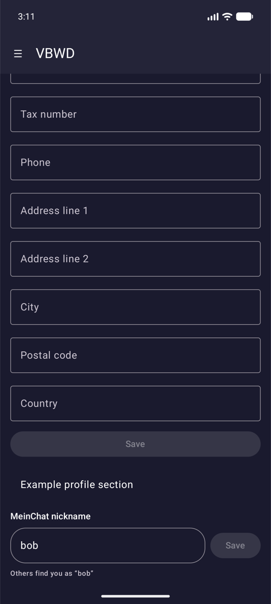

# MeinChat reference

[← Back to index](index.md)

`vbwd-android-meinchat` is the most feature-complete plugin and a good template
for rich, stateful features. It registers a prefix route (`/meinchat`), a profile
section, a menu item, stores, an auth-aware push-token sink, and exposes a
secure-messaging seam that `meinchat-plus` fills. The screenshots below are from
the running example app.

## Direct messaging — inbox & conversations

The inbox lists conversations as cards (colour-keyed initials avatar, last-message
preview, unread badge) with a **Chats / Rooms** toggle and a **+ New chat** entry.

A conversation renders message **bubbles** — outgoing right (primary), incoming
left (surfaceVariant) with the sender name — a top bar, and a rounded input with a
circular send button. The thread is sorted by sent time and auto-scrolls to the
newest message.

## Token transfers

In-chat token transfers arrive as messages with `system_kind = token_transfer`
and a JSON body. The UI parses them and renders a **card** ("Sent / Received N
tokens to / from X", plus an optional note) instead of raw JSON — right-aligned
when you are the sender.

## Image attachments

Message image attachments (`storage_url` is relative `/uploads/...`) are resolved
against the host origin and loaded with Coil.

## Group rooms

The **Rooms** tab lists group rooms (member count, unread badge); opening one
reuses the same bubble UI with the room name + member count in the top bar.

## Find users / start a chat

**+ New chat** searches users by nickname and opens (or creates) a conversation on
tap.

## Nickname management

A profile section (`ProfileMeinChatNickname`) lets the user view and change their
meinchat nickname.

## How it maps to the contract

| Feature | Seam used |
|---------|-----------|
| `/meinchat` screen | `addRoute(PluginRoute(matchPrefix = true, requiresAuth = true))` |
| Nickname editor | `addComponent("ProfileMeinChatNickname") { … }` |
| Side-menu entry | `addMenuItem(MenuItem(routePath = "/meinchat", …))` |
| Limits / retention / cache | `createStore("meinchat…", …)` |
| Push token relay | `sdk.notifications.registerSink(...)`, `events.on(AUTH_LOGIN/LOGOUT)` |
| Backend calls | `sdk.api.get/post(...)` |
| Media origin | derived from `sdk.apiConfig.baseUrl` |
| E2E seam | a store id consumed by `meinchat-plus` (the one declared peer dependency) |

Automated coverage of these screens lives in `MeinChatScreenTest` (Robolectric
Compose tests); see [Testing & the quality gate](testing.md).

---

Next: [Published artifacts →](artifacts.md)
